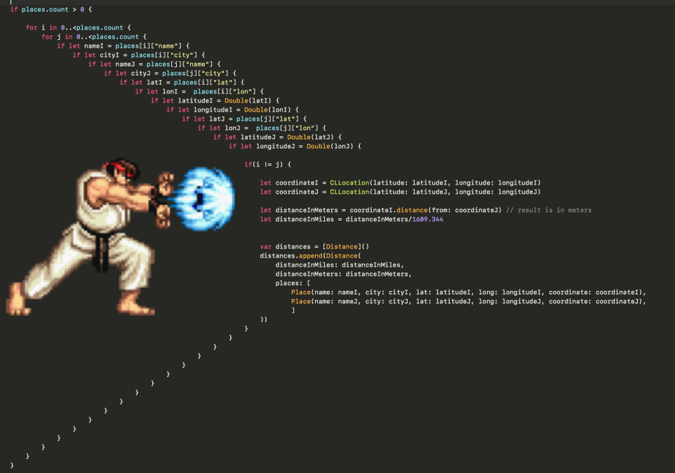

<style>
div.colwrap {
  background-color: inherit;
  color: inherit;
  width: 100%;
  height: 100%;
}
div.colwrap div h1:first-child, div.colwrap div h2:first-child {
  margin-top: 0px !important;
}
div.colwrap div.left, div.colwrap div.right {
  position: absolute;
  top: 0;
  bottom: 0;
  padding: 70px 35px 70px 70px;
}
div.colwrap div.left {
  right: 50%;
  left: 0;
}
div.colwrap div.right {
  left: 50%;
  right: 0;
}
div.out {
--color-foreground: #000;
}
div.it {
--color-foreground: #006;
}
</style>
<!-- header: '**Computation Expression** | Option | Result | Monad | Result ex. | Async | Overloaded Binds | Task' -->

# Computation Expression

```fsharp
task {
    let! entry = db.GetEntry entryId
    let! list = db.GetList entry.ListId
    let! user = db.GetUser list.UserId
    return user
}
```

---

# Computation Expression

```fsharp
task {
    let! entry = db.GetEntry entryId
    let! list = db.GetList entry.ListId
    let! user = db.GetUser list.UserId
    return user
}
```

What exactly is `let!`?

---

# Computation Expression - In this talk

* Lots of code examples

* `let!` - `Bind` explained with examples

* Simple computation expressions examples (Option, Result)

* Monad :)

* Some practical examples using Result

* Async

* Task

---
<div class="colwrap"><div class="left">


## Code blocks

```fsharp
let x = 1
let y = 2
x + y
```

Every `let` introduces code block - from `let` to end of the scope.

</div><div class="right">

Can be rewritten as

```fsharp
1 |> (fun x ->
  2 |> (fun y ->
      x + y
  )
)
```


</div></div>

---

### What if we can insert function call for each block?

```fsharp
let bind f = fun x ->
  printfn "log: %A" x
  f x
```

```fsharp
1
|> bind (fun x ->
  2 |> bind (fun y ->
      x + y))
```

<div class="out">

```
log: 1
log: 2
```

</div>

<div class="out">

```
3
```

</div>

---
<div class="colwrap"><div class="left">


### Computation Expression

```fsharp
type LoggerCE() =
    member __.Bind(x, f) =
        printfn "log: %A" x
        f x
    member __.Return x = x
let logger = LoggerCE()
```


</div><div class="right">


```fsharp
let logIt() =
    logger {
      let! x = 1
      let! y = 2
      return x + y
    }
logIt()
```

<div class="out">

```
log: 1
log: 2
```

</div>

<div class="out">

```
3
```

</div>


</div></div>

---

```fsharp
let logIt_Expanded() =
    logger.Bind(1, fun x ->
        logger.Bind(2, fun y ->
            logger.Return(x + y)))
logIt_Expanded()
```

<div class="out">

```
log: 1
log: 2
```

</div>

<div class="out">

```
3
```

</div>

Note: scope is explicit.

---


<!-- header: 'Computation Expression | **Option** | Result | Monad | Result ex. | Async | Overloaded Binds | Task' -->

# Option

---

## Pyramid of doom



---

# Option

## Pyramid of doom

```fsharp
let optionGetUserFromEntry (db: ITodoDb) entryId =
    match db.GetEntry entryId with
    | Some entry ->
        match db.GetList entry.ListId with
        | Some list ->
            match db.GetUser list.UserId with
            | Some user -> Some user
            | None -> None
        | None -> None
    | None -> None
```

---

# Option

## Realworld example - TODO list

User has **todo** lists and inside each list **todo** entries

```fsharp
type Guid = System.Guid
type User = { Id: Guid; Username: string }
type TodoList = { Id: Guid; UserId: Guid }
type TodoEntry = { Id: Guid; ListId: Guid }

type ITodoDb = {
  GetUser: Guid -> User option
  GetList: Guid -> TodoList option
  GetEntry: Guid -> TodoEntry option }
```

---

### Test data

```fsharp
let entryId = Guid.NewGuid()
let todoDb =
    let user = { Id = Guid.NewGuid(); Username = "user1" }
    let list = { Id = Guid.NewGuid(); UserId = user.Id }
    let entry = { Id = entryId; ListId = list.Id }
    { GetUser = (fun id -> if id = user.Id then Some user else None)
      GetList = (fun id -> if id = list.Id then Some list else None)
      GetEntry = (fun id -> if id = entry.Id then Some entry else None) }
```

---
<div class="colwrap"><div class="left">


## Option - match

```fsharp
let optionGetUserFromEntry (db: ITodoDb) entryId =
    match db.GetEntry entryId with
    | Some entry ->
        match db.GetList entry.ListId with
        | Some list ->
            match db.GetUser list.UserId with
            | Some user -> Some user
            | None -> None
        | None -> None
    | None -> None
```


</div><div class="right">


```fsharp
optionGetUserFromEntry todoDb entryId
```

<div class="out">

```
Some { Id = 7530ab4e-aa7e-410d-93f8-ee756f43d25c
       Username = "user1" }
```

</div>


</div></div>

---
<div class="colwrap"><div class="left">


## Option - CE

```fsharp
module Option =
    let bind f x =
        match x with
        | Some x -> f x
        | None -> None
```

```fsharp
type OptionCE() =
    // let!
    member __.Bind(x, f) =
        Option.bind f x
    // return
    member __.Return x = Some x
    // return!
    member __.ReturnFrom x = x
let maybe = OptionCE()
```


</div><div class="right">


```fsharp
let optionGetUserFromEntry_CE (db: ITodoDb) entryId =
    maybe {
        let! entry = db.GetEntry entryId
        let! list = db.GetList entry.ListId
        let! user = db.GetUser list.UserId
        return user
    }
```

```fsharp
optionGetUserFromEntry_CE todoDb entryId
```

<div class="out">

```
Some { Id = 7530ab4e-aa7e-410d-93f8-ee756f43d25c
       Username = "user1" }
```

</div>


</div></div>

---
<div class="colwrap"><div class="left">


## Option - CE - syntax sugar

```fsharp
let optionGetUserFromEntry_CE (db: ITodoDb) entryId =
    maybe {
        let! entry = db.GetEntry entryId
        let! list = db.GetList entry.ListId
        let! user = db.GetUser list.UserId
        return user
    }
```

```fsharp
let optionGetUserFromEntry_CE_Expanded (db: ITodoDb) entryId =
    maybe.Bind(db.GetEntry entryId, fun entry ->
        maybe.Bind(db.GetList entry.ListId, fun list ->
            maybe.Bind(db.GetUser list.UserId, fun user ->
                maybe.Return user)))
```


</div><div class="right">


```fsharp
optionGetUserFromEntry_CE_Expanded todoDb entryId
```

<div class="out">

```
Some { Id = 7530ab4e-aa7e-410d-93f8-ee756f43d25c
       Username = "user1" }
```

</div>


</div></div>

---


<!-- header: 'Computation Expression | Option | **Result** | Monad | Result ex. | Async | Overloaded Binds | Task' -->

# Result

---

# Result

## Realworld example - TODO list

User has **todo** lists and inside each list **todo** entries

```fsharp
type Guid = System.Guid
type User = { Id: Guid; Username: string }
type TodoList = { Id: Guid; UserId: Guid }
type TodoEntry = { Id: Guid; ListId: Guid }

type ITodoDb = {
  GetUser: Guid -> Result<User, string>
  GetList: Guid -> Result<TodoList, string>
  GetEntry: Guid -> Result<TodoEntry, string> }
```

---

### Test data

```fsharp
let entryId = Guid.NewGuid()
let todoDb =
    let user = { Id = Guid.NewGuid(); Username = "user1" }
    let list = { Id = Guid.NewGuid(); UserId = user.Id }
    let entry = { Id = entryId; ListId = list.Id }
    { GetUser = (fun id -> if id = user.Id then Ok user else Error "user not found")
      GetList = (fun id -> if id = list.Id then Ok list else Error "list not found")
      GetEntry = (fun id -> if id = entry.Id then Ok entry else Error "entry not found") }
```

---
<div class="colwrap"><div class="left">


## Result - match

```fsharp
let resultGetUserFromEntry_match (db: ITodoDb) entryId =
    match db.GetEntry entryId with
    | Ok entry ->
        match db.GetList entry.ListId with
        | Ok list ->
            match db.GetUser list.UserId with
            | Ok user -> Ok user
            | Error msg -> Error msg
        | Error msg -> Error msg
    | Error msg -> Error msg
```


</div><div class="right">


```fsharp
resultGetUserFromEntry_match todoDb entryId
```

<div class="out">

```
Ok { Id = 98e685b2-29d9-4ba6-a2b7-c28714bbf281
     Username = "user1" }
```

</div>


</div></div>

---
<div class="colwrap"><div class="left">


## Result - CE

```fsharp
module Result =
    let bind f = function
        | Ok value -> f value
        | Error msg -> Error msg
```

```fsharp
type ResultCE() =
    member this.Bind (result, f) =
        Result.bind f result
    member this.Return value = Ok value
    member this.ReturnFrom value = value
let result = ResultCE()
```


</div><div class="right">


```fsharp
let resultGetUserFromEntry_CE (db: ITodoDb) entryId =
    result {
        let! entry = db.GetEntry entryId
        let! list = db.GetList entry.ListId
        let! user = db.GetUser list.UserId
        return user
    }
```

```fsharp
resultGetUserFromEntry_CE todoDb entryId
```

<div class="out">

```
Ok { Id = 98e685b2-29d9-4ba6-a2b7-c28714bbf281
     Username = "user1" }
```

</div>


</div></div>

---
<div class="colwrap"><div class="left">


## Result - CE - syntax sugar

```fsharp
let resultGetUserFromEntry_CE (db: ITodoDb) entryId =
    result {
        let! entry = db.GetEntry entryId
        let! list = db.GetList entry.ListId
        let! user = db.GetUser list.UserId
        return user
    }
```

```fsharp
let resultGetUserFromEntry_CE_Expanded (db: ITodoDb) entryId =
    result.Bind (db.GetEntry entryId, fun entry ->
        result.Bind (db.GetList entry.ListId, fun list ->
            result.Bind (db.GetUser list.UserId, fun user ->
                result.Return user)))
```


</div><div class="right">


```fsharp
resultGetUserFromEntry_CE_Expanded todoDb entryId
```

<div class="out">

```
Ok { Id = 98e685b2-29d9-4ba6-a2b7-c28714bbf281
     Username = "user1" }
```

</div>


</div></div>

---


<!-- header: 'Computation Expression | Option | Result | **Monad** | Result ex. | Async | Overloaded Binds | Task' -->

# CE and Monad

---

# CE and Monad

Is Computation Expression a Monad?

<!-- Monády, o nichž zde bude řeč, nejsou nic jiného než jednoduché substance, z nichž se dohromady skládají věci   -->


---

## What Monad?

* Category theory

* Functional programming

* <i>Linear algebra (we skip this one)</i>

* Philosophy

---

## Is Computation Expression a (Category theory) Monad?


---

* No
  

* (Category theory) Monad is an abstract math term, that's not really useful in the context of programming.
  

<!-- Monoid on top of functions -->
* 
  

* Very roughly: Monad is a monoid on top of functions (function = code block).
  

---

## Is Computation Expression a (FP) Monad?

* Yes

* and No

---

### ✅ Monad laws in FP

> A monad can be created by defining a type constructor M and two operations:
`return :: a -> M a` (often also called unit), which receives a value of type `a` and wraps it into a monadic value of type `m a`, and
`bind :: (M a) -> (a -> M b) -> (M b)` (typically represented as `>>=`), which receives a function `f` over type `a` and can transform monadic values `m a` applying `f` to the unwrapped value `a`, returning a monadic value `M b`.
> 

**Looks like exactly what we have in Computation Expression.**

---

## ❌

* There is nothing as "Monad" type `M` in F# - we can't use `Bind` of generic **CE**.

* It's not possible due to lack of <i>higher kinded types</i>.

* <i>Higher kinded types</i> are not supported in F# by design, because it leads to type over-engineering.

* 

---

## Abstraction and application

* **Monad as Category Theory abstraction**
  

* ⬇ application - replace transformations with functions
  

* **Monad in FP - `Bind` and `Return` functions**
  

* ⬇ application - fixing "monad" type
  

* **FP Monad in F# - Computation Expression**
  

---

## Is this Monad thing important for F#?

* CE is a sort of application of application of Monad.

* Understanding Monad is not necessary to understand CE.

* It can be useful to know connection between CE and Monad.

---


<!-- header: 'Computation Expression | Option | Result | Monad | **Result ex.** | Async | Overloaded Binds | Task' -->

# Result examples

---

# Result examples

## Result - CE

```fsharp
type ResultCE() =
    member this.Bind (result, f) = Result.bind f result
    member this.Return value = Ok value
    member this.ReturnFrom value = value
let result = ResultCE()
```

---

## recursive result CE - going through list

```fsharp
// get list of values if no Error case, otherwise return first Error
// recursive loop, hard to read
let listResultAcc (xs : list<Result<'a, string>>) : Result<list<'a>, string> =
    let rec loop xs acc =
        match xs with
        | [] -> Ok (List.rev acc)
        | Ok x :: xs -> loop xs (x :: acc)
        | Error e :: _ -> Error e
    loop xs []
```

---
<div class="colwrap"><div class="left">


```fsharp
// with result CE - no need to handle Error case, no List.rev
let rec listResultCE (xs : list<Result<'a, string>>) 
    : Result<list<'a>, string> = 
    result {
        match xs with
        | [] -> return []
        | hd :: tl ->
            let! y = hd
            let! rest = listResultCE tl
            return y :: rest }
```

<sub><sup><gray>(but not tail recursive)</gray></sup></sub>

</div><div class="right">


```fsharp
listResultCE [Ok 1; Ok 2; Ok 3]
```

<div class="out">

```
Ok [1; 2; 3]
```

</div>

```fsharp
listResultCE [Ok 1; Error "boom"; Ok 3]
```

<div class="out">

```
Error "boom"
```

</div>

```fsharp
listResultCE ([1 .. 10000] |> List.map Ok)
```

<div class="out">

```fsharp
Stack overflow. 
```

</div>

</div></div>

---

## Result - error by condition

```fsharp
result {
    let! x = Ok 1
    let! _ = if condition then Error "boom" else Ok ()
    return x }
```

<div class="out">

```
Error "boom"
```

</div>

---


<!-- header: 'Computation Expression | Option | Result | Monad | Result ex. | **Async** | Overloaded Binds | Task' -->

## Async

---

## Async - CE

naive implementation

```fsharp
type AsyncCE() =
    member this.Bind (a, f) = Async.RunSynchronously a |> f
    member this.Return value = Async.FromContinuations(fun (s, e, c) -> s value)
let async1 = AsyncCE()
```

---
<div class="colwrap"><div class="left">


Problem: async1 is not lazy

```fsharp
let async1Example = async1 {
    printfn "Starting"
    let! x = async1 { return 1 }
    printfn "Running"
    return x + 1 }
```

<div class="out">

```
Starting
Running
```

</div>


</div><div class="right">


```fsharp
let asyncExample = async {
    printfn "Starting"
    let! x = async { return 1 }
    printfn "Running"
    return x + 1 }
```

<div class="out">

```
```

</div>


</div></div>

---

## Async - CE

add laziness

```fsharp
type AsyncCE2() =
    member this.Bind (a, f) = Async.RunSynchronously a |> f
    member this.Return value = value
    member this.Delay f = // (unit -> 'a) -> Async<'a>
        Async.FromContinuations(fun (s, e, c) -> s (f ()))
let async2 = AsyncCE2()
```

---
<div class="colwrap"><div class="left">


```fsharp
let async2Example = async2 {
    printfn "Starting"
    let! x = async2 { return 1 }
    printfn "Running"
    return x + 1 }
```


</div><div class="right">


```fsharp
async2Example
```

<div class="out">

```
```

</div>

```fsharp
async2Example |> Async.RunSynchronously
```

<div class="out">

```
Starting
Running
```

</div>


</div></div>

---

## How it works:
(from Computation Expressions docs)

> The compiler, when it parses a computation expression, converts the expression into a series of nested function calls ... :
`builder.Run(builder.Delay(fun () -> {| cexpr |}))`
In the above code, the calls to Run and Delay are omitted if they are not defined in the computation expression builder class. ...
> 

---

## Async - CE - syntax sugar

```fsharp
let async2Example = async2 {
    printfn "Starting"
    let! x = async2 { return 1 }
    printfn "Running"
    return x + 1 }
```

```fsharp
let a_Expanded =
    async2.Delay(fun () ->
        printfn "Starting"
        async2.Bind(async2.Delay(fun () -> async2.Return(1)), fun x ->
            printfn "Running"
            async2.Return (x + 1)))

a_Expanded |> Async.RunSynchronously
```

<div class="out">

```
Starting
Running
```

</div>

---

## Realworld example - TODO list

User has **todo** lists and inside each list **todo** entries

```fsharp
type Guid = System.Guid
type User = { Id: Guid; Username: string }
type TodoList = { Id: Guid; UserId: Guid }
type TodoEntry = { Id: Guid; ListId: Guid }

type ITodoDb = {
  GetUser: Guid -> Async<User>
  GetList: Guid -> Async<TodoList>
  GetEntry: Guid -> Async<TodoEntry> }
```

---

### Test data

```fsharp
let entryId = Guid.NewGuid()
let todoDb =
    let user = { Id = Guid.NewGuid(); Username = "user1" }
    let list = { Id = Guid.NewGuid(); UserId = user.Id }
    let entry = { Id = entryId; ListId = list.Id }
    { GetUser = (fun id -> async { return if id = user.Id then user else failwith "user not found" })
      GetList = (fun id -> async { return if id = list.Id then list else failwith "list not found" })
      GetEntry = (fun id -> async { return if id = entry.Id then entry else failwith "entry not found"}) }
```

---

```fsharp
let asyncGetUserFromEntry_CE (db: ITodoDb) entryId =
    async2 {
        let! entry = db.GetEntry entryId
        let! list = db.GetList entry.ListId
        let! user = db.GetUser list.UserId
        return user
    }
```

```fsharp
asyncGetUserFromEntry_CE todoDb entryId |> Async.RunSynchronously
```

<div class="out">

```
{ Id = 8165ad6e-c8c8-4a89-addc-722512416a25
  Username = "user1" }
```

</div>

---
<div class="colwrap"><div class="left">


```fsharp
let asyncGetUserFromEntry_CE (db: ITodoDb) entryId =
    async2 {
        let! entry = db.GetEntry entryId
        let! list = db.GetList entry.ListId
        let! user = db.GetUser list.UserId
        return user
    }
```

```fsharp
let asyncGetUserFromEntry_CE_Expanded (db: ITodoDb) entryId =
    async2.Delay(fun () ->
        async2.Bind(db.GetEntry entryId, fun entry ->
            async2.Bind(db.GetList entry.ListId, fun list ->
                async2.Bind(db.GetUser list.UserId, fun user ->
                    async2.Return user))))
```


</div><div class="right">


```fsharp
asyncGetUserFromEntry_CE_Expanded todoDb entryId |> Async.RunSynchronously
```

<div class="out">

```
{ Id = 8165ad6e-c8c8-4a89-addc-722512416a25
  Username = "user1" }
```

</div>


</div></div>

---


<!-- header: 'Computation Expression | Option | Result | Monad | Result ex. | Async | **Overloaded Binds** | Task' -->

# Task Prelude - Overloaded Bind

---

# Overloaded Bind - Result

extended with auto-convert from `option`

```fsharp
module Result =
    let ofOption option =
        match option with
        | Some value -> Ok value
        | None -> Error "None"
```

```fsharp
type ResultCE() =
    member this.Bind (result, f) = Result.bind f result
    member this.Bind (option, f) = Result.bind f (Result.ofOption option)
    member this.Return value = Ok value
let result = ResultCE()
```

---

```fsharp
type ResultCE() =
    member this.Bind (result, f) = Result.bind f result
    member this.Bind (option, f) = Result.bind f (Result.ofOption option)
    member this.Return value = Ok value
let result = ResultCE()
```

```fsharp
result {
    let! a = Ok 1
    let! b = Some 2
    return a + b
}
```

<div class="out">

```
Ok 3
```

</div>

---


<!-- header: 'Computation Expression | Option | Result | Monad | Result ex. | Async | Overloaded Binds | **Task**' -->

# Task

---

# Task

resumable code

<small>https://github.com/fsharp/fslang-design/blob/main/FSharp-6.0/FS-1087-resumable-code.md</small>
Inside CE - intermediate type `TaskCode` is used

`async` can be used in CE without conversion

`task` is not lazy (hot-start), creating value of `Task<_>` type starts execution.

---

```fsharp
type TaskLike<'a> = { Run : unit -> 'a }

open System.Threading.Tasks
type TaskCE() =
    member this.Bind (t: Task<'a>, f: 'a -> TaskLike<'b>) = 
        { Run = fun () -> t.Result |> f |> fun x -> x.Run() }
    member this.Bind (a: Async<'a>, f: 'a -> TaskLike<'b>) = 
        { Run = fun () -> Async.RunSynchronously a |> f |> fun x -> x.Run() }
    member this.Bind (a: TaskLike<'a>, f: 'a -> TaskLike<'b>) = 
        { Run = fun () -> a.Run() |> f |> fun x -> x.Run() }
    member this.Return value = { Run = fun () -> value }
    member this.Run (taskLike: TaskLike<_>) = Task.Factory.StartNew(taskLike.Run)
let task1 = TaskCE()
```

---

```fsharp
let task1Example = task1 {
    printfn "Starting"
    let! x = task { return 1 }
    let! y = async { return 2 }
    printfn "Running"
    return x + y }
task1Example.Result
```

<div class="out">

```
Starting
Running
```

</div>

<div class="out">

```
3
```

</div>

---

```fsharp
let task1ErrorExample = task1 {
    printfn "Starting"
    let! x = 1 // error
    let! y = async { return 2 }
    printfn "Running"
    return x + y }
```

```fsharp
No overloads match for method 'Bind'.
Known types of arguments: int * (int -> TaskLike<int>)
Available overloads:
 - member TaskCE.Bind: a: Async<'a> * f: ('a -> TaskLike<'b>) -> TaskLike<'b> // Argument 'a' doesn't match
 - member TaskCE.Bind: a: TaskLike<'a> * f: ('a -> TaskLike<'b>) -> TaskLike<'b> // Argument 'a' doesn't match
 - member TaskCE.Bind: t: Task<'a> * f: ('a -> TaskLike<'b>) -> TaskLike<'b> // Argument 't' doesn't match
```

---

```fsharp
let taskErrorExample = task {
    printfn "Starting"
    let! x = 1 // error
    let! y = async { return 2 }
    printfn "Running"
    return x + y }
```

```fsharp
No overloads match for method 'Bind'.
Known types of arguments: int * (int -> TaskCode<int,int>)
Available overloads:
 - member TaskBuilderBase.Bind: computation: Async<'TResult1> * continuation: ('TResult1 -> TaskCode<'TOverall,'TResult2>) 
    -> TaskCode<'TOverall,'TResult2> // Argument 'computation' doesn't match
 - member TaskBuilderBase.Bind: task: Task<'TResult1> * continuation: ('TResult1 -> TaskCode<'TOverall,'TResult2>) 
    -> TaskCode<'TOverall,'TResult2> // Argument 'task' doesn't match
 - member TaskBuilderBase.Bind: task: ^TaskLike * continuation: ('TResult1 -> TaskCode<'TOverall,'TResult2>) 
    -> TaskCode<'TOverall,'TResult2> when ^TaskLike: (member GetAwaiter: unit -> ^Awaiter) 
    and ^Awaiter :> System.Runtime.CompilerServices.ICriticalNotifyCompletion 
    and ^Awaiter: (member get_IsCompleted: unit -> bool) 
    and ^Awaiter: (member GetResult: unit -> 'TResult1) // Argument 'task' doesn't match
```

---

## Realworld example - TODO list

User has **todo** lists and inside each list **todo** entries

```fsharp
type Guid = System.Guid
type User = { Id: Guid; Username: string }
type TodoList = { Id: Guid; UserId: Guid }
type TodoEntry = { Id: Guid; ListId: Guid }

type ITodoDb = {
  GetUser: Guid -> Task<User>
  GetList: Guid -> Task<TodoList>
  GetEntry: Guid -> Task<TodoEntry> }
```

---

### Test data

```fsharp
let entryId = Guid.NewGuid()
let todoDb =
    let user = { Id = Guid.NewGuid(); Username = "user1" }
    let list = { Id = Guid.NewGuid(); UserId = user.Id }
    let entry = { Id = entryId; ListId = list.Id }
    { GetUser = (fun id -> task { return if id = user.Id then user else failwith "user not found" })
      GetList = (fun id -> task { return if id = list.Id then list else failwith "list not found" })
      GetEntry = (fun id -> task { return if id = entry.Id then entry else failwith "entry not found"}) }
```

---

```fsharp
let taskGetUserFromEntry_CE (db: ITodoDb) entryId =
    task1 {
        let! entry = db.GetEntry entryId
        let! list = db.GetList entry.ListId
        let! user = db.GetUser list.UserId
        return user
    }
```

```fsharp
taskGetUserFromEntry_CE todoDb entryId |> fun t -> t.Result
```

<div class="out">

```
{ Id = 851e90fb-5be0-4d2b-973f-19c9b83b60de
  Username = "user1" }
```

</div>

---
<div class="colwrap"><div class="left">


```fsharp
let taskGetUserFromEntry_CE (db: ITodoDb) entryId =
    task1 {
        let! entry = db.GetEntry entryId
        let! list = db.GetList entry.ListId
        let! user = db.GetUser list.UserId
        return user
    }
```

```fsharp
let taskGetUserFromEntry_CE_Expanded (db: ITodoDb) entryId =
    task1.Run(
        task1.Bind(db.GetEntry entryId, fun entry ->
            task1.Bind(db.GetList entry.ListId, fun list ->
                task1.Bind(db.GetUser list.UserId, fun user ->
                    task1.Return user))))
```


</div><div class="right">


```fsharp
taskGetUserFromEntry_CE_Expanded todoDb entryId |> fun t -> t.Result
```

<div class="out">

```
{ Id = 851e90fb-5be0-4d2b-973f-19c9b83b60de
  Username = "user1" }
```

</div>


</div></div>

---

# There is LOT more

* CE combinations (`asyncResult`, `taskResult`)

* `seq` CE, `list` CE

* state CE

* DB query like CE

* custom operations

* `and!`

* ...

---

# QUESTIONS ???

---


<!-- header: '**BONUS LEVEL**' -->

# BONUS LEVEL

## Catamorphism

---

# Seq CE as a backtracking algorithm

Simple example: find all combinations of numbers that sum to the target number.

---

```fsharp
let solutions =
    seq {
        for a in [ 1..6 ] do
            for b in [ 1..6 ] do
                for c in [ 1..6 ] do
                    if a + b + c = 10 then
                        yield (a, b, c)
    }


solutions |> Seq.toList
```

<div class="out">

```
[(1, 3, 6); (1, 4, 5); (1, 5, 4); (1, 6, 3); (2, 2, 6); (2, 3, 5); (2, 4, 4);
 (2, 5, 3); (2, 6, 2); (3, 1, 6); (3, 2, 5); (3, 3, 4); (3, 4, 3); (3, 5, 2);
 (3, 6, 1); (4, 1, 5); (4, 2, 4); (4, 3, 3); (4, 4, 2); (4, 5, 1); (5, 1, 4);
 (5, 2, 3); (5, 3, 2); (5, 4, 1); (6, 1, 3); (6, 2, 2); (6, 3, 1)]
```

</div>

---
<div class="colwrap"><div class="left">


We can filter out variants in each step:

```fsharp
let solutionsNoDuplicates =
    seq {
        for a in [ 1..6 ] do
            for b in [ a + 1 .. 6 ] do
                for c in [ b + 1 .. 6 ] do
                    if a + b + c = 10 then
                        yield (a, b, c)
    }
```


</div><div class="right">


```fsharp
solutionsNoDuplicates |> Seq.toList
```

<div class="out">

```
[(1, 3, 6); (1, 4, 5); (2, 3, 5)]
```

</div>


</div></div>

---
<div class="colwrap"><div class="left">


It can also be recursive!

```fsharp
let rec solutionsAnyLength acc =
    seq {
        let from = List.tryHead acc |> Option.defaultValue 1

        for x in [ from..6 ] do
            if List.sum (x :: acc) < 10 then
                yield! solutionsAnyLength (x :: acc)
            elif List.sum (x :: acc) = 10 then
                yield (x :: acc)
    }
```

This is actually a catamorphism!


</div><div class="right">


```fsharp
solutionsAnyLength [] |> Seq.toList
```

<div class="out">

```
[[1; 1; 1; 1; 1; 1; 1; 1; 1; 1]; [2; 1; 1; 1; 1; 1; 1; 1; 1];
 [3; 1; 1; 1; 1; 1; 1; 1]; [2; 2; 1; 1; 1; 1; 1; 1]; [4; 1; 1; 1; 1; 1; 1];
 [3; 2; 1; 1; 1; 1; 1]; [5; 1; 1; 1; 1; 1]; [2; 2; 2; 1; 1; 1; 1];
 [4; 2; 1; 1; 1; 1]; [3; 3; 1; 1; 1; 1]; [6; 1; 1; 1; 1]; [3; 2; 2; 1; 1; 1];
 [5; 2; 1; 1; 1]; [4; 3; 1; 1; 1]; [2; 2; 2; 2; 1; 1]; [4; 2; 2; 1; 1];
 [3; 3; 2; 1; 1]; [6; 2; 1; 1]; [5; 3; 1; 1]; [4; 4; 1; 1]; [3; 2; 2; 2; 1];
 [5; 2; 2; 1]; [4; 3; 2; 1]; [3; 3; 3; 1]; [6; 3; 1]; [5; 4; 1]; [2; 2; 2; 2; 2];
 [4; 2; 2; 2]; [3; 3; 2; 2]; [6; 2; 2]; [5; 3; 2]; [4; 4; 2]; [4; 3; 3]; [6; 4];
 [5; 5]]
```

</div>


</div></div>

---
<div class="colwrap"><div class="left">


## Seq CE as sudoku solver

```fsharp
type Sudoku = Map<int * int, int>

let row (i, j) =
    ([ 1 .. j - 1 ] @ [ j + 1 .. 9 ]) |> Seq.map (fun k -> (i, k))

let column (i, j) =
    ([ 1 .. i - 1 ] @ [ i + 1 .. 9 ]) |> Seq.map (fun k -> (k, j))

let square (i, j) =
    let i' = (i - 1) / 3 * 3 + 1
    let j' = (j - 1) / 3 * 3 + 1

    seq {
        for k in [ i' .. i' + 2 ] do
            for l in [ j' .. j' + 2 ] do
                if (i, j) <> (k, l) then
                    yield (k, l)
    }
```


</div><div class="right">


```fsharp
let filledNumbers (sud: Sudoku) xs =
    xs |> Seq.choose (fun (i, j) -> Map.tryFind (i, j) sud) |> set

let rec solve sud =
    seq {
        let toSolve =
            [ 1..9 ]
            |> Seq.collect (fun i -> [ 1..9 ] |> Seq.map (fun j -> (i, j)))
            |> Seq.filter (fun (i, j) -> Map.containsKey (i, j) sud |> not)

        match toSolve |> Seq.tryHead with
        | Some(i, j) ->
            let invalid =
                [ row; column; square ]
                |> List.map (fun f -> f (i, j) |> filledNumbers sud)
                |> Set.unionMany

            let candidates = set [ 1..9 ] - invalid

            for x in candidates do
                yield! solve (sud |> Map.add (i, j) x)
        | None -> yield sud
    }
```


</div></div>

---

## Example

```fsharp
// parse sudoku from http://sudocue.net/daily.php format
let parseSudoku (s: string) =
    (Map.empty, Seq.indexed s)
    ||> Seq.fold (fun m (i, c) -> 
        let x = int (string c) 
        if x > 0 then Map.add (i / 9 + 1, i % 9 + 1) x m else m)

let printSudoku s =
    for i in [ 1..9 ] do
        for j in [ 1..9 ] do
            printf "%i" (Map.tryFind (i, j) s |> Option.defaultValue 0)

        printfn ""

let solveAndPrint sud =
    solve sud |> Seq.tryHead |> Option.iter printSudoku
```

---
<div class="colwrap"><div class="left">


```fsharp
// http://sudocue.net/daily.php, daily nightmare July 24, 2023
let ex =
    parseSudoku "000904702004010006002000500600000204050000900400700001000005000298600000070090000"
```

```fsharp
printSudoku ex
```

<div class="out">

```
000904702
004010006
002000500
600000204
050000900
400700001
000005000
298600000
070090000
```

</div>


</div><div class="right">


```fsharp
// http://sudocue.net/daily.php, daily nightmare July 24, 2023
let ex =
    parseSudoku "000904702004010006002000500600000204050000900400700001000005000298600000070090000"
```

```fsharp
solveAndPrint ex
```

<div class="out">

```
365984712
784512396
912367548
637159284
851426937
429738651
143275869
298643175
576891423
```

</div>


</div></div>

---


